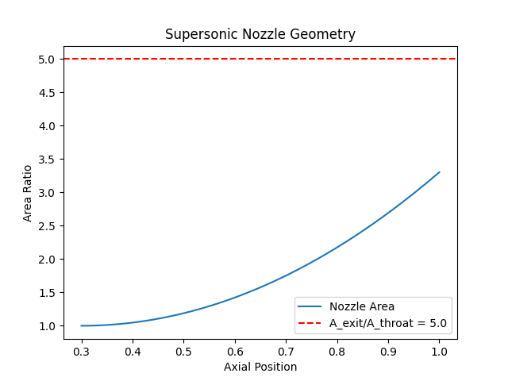
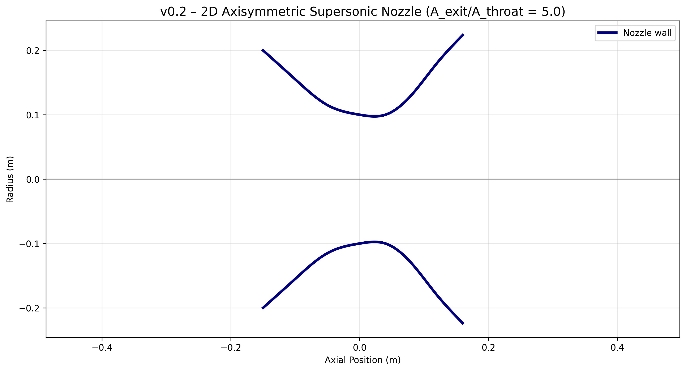

# Supersonic-Nozzle-CFD
Open-source CFD solver for rocket nozzle design, built by Loughborough University Aeronautical Engineering MEng Student.

## v0.1 – 1D Isentropic Flow (17 Nov 2025)
- p₀ = 1 MPa, T₀ = 300 K, p_exit = 100 kPa, A_ratio = 5  
- Exit Mach 3.17 • Velocity 635 m/s • Temp 99.5 K  


## v0.2 – 2D Axisymmetric Rao Bell Nozzle (24 Nov 2025)
Realistic converging-diverging geometry (R_throat = 0.1 m, A_exit/A_throat = 5.0)  


### v0.3.1 LIVE – Now predicts real-world shock formation
- New: Isentropic exit pressure + back-pressure mismatch warning
- Default case (100 kPa back pressure) → 376% mismatch → shocks expected
- Set pₑ ≈ 21 kPa → perfectly expanded

Live demo: https://nozzle-solver.streamlit.app

```bash
py nozzle_solver.py          # v0.1
py nozzle_geometry_2d.py     # v0.2s